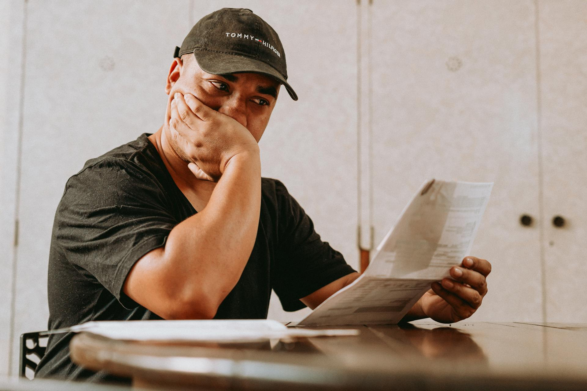
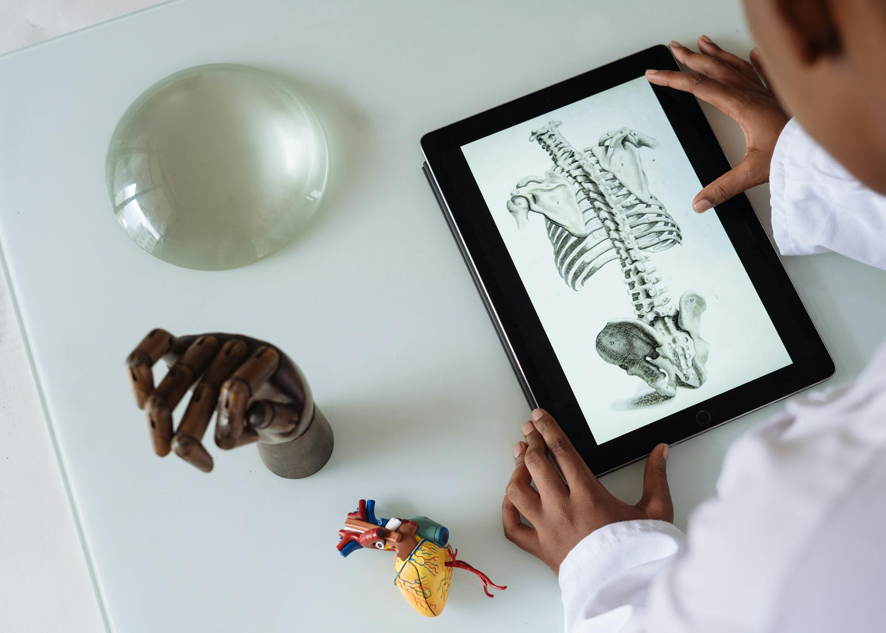
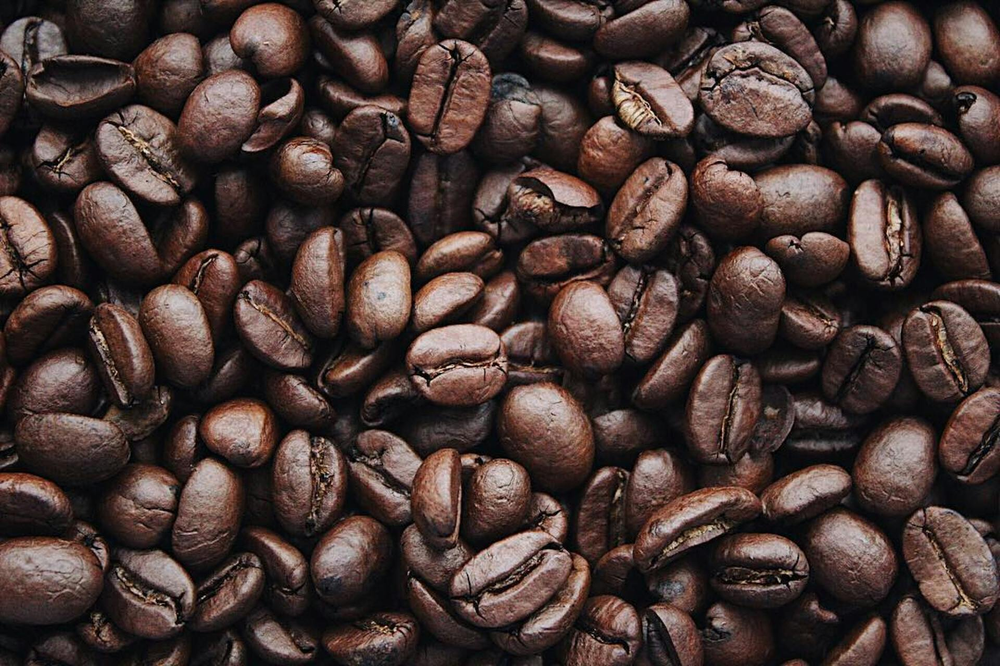
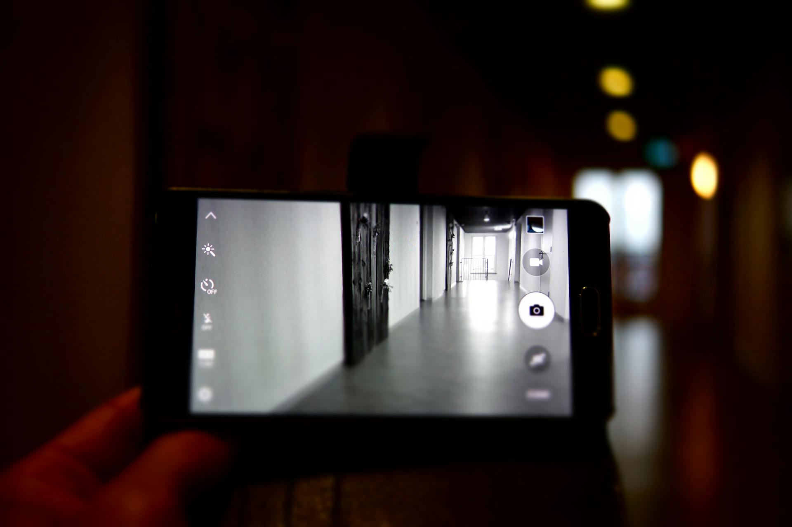
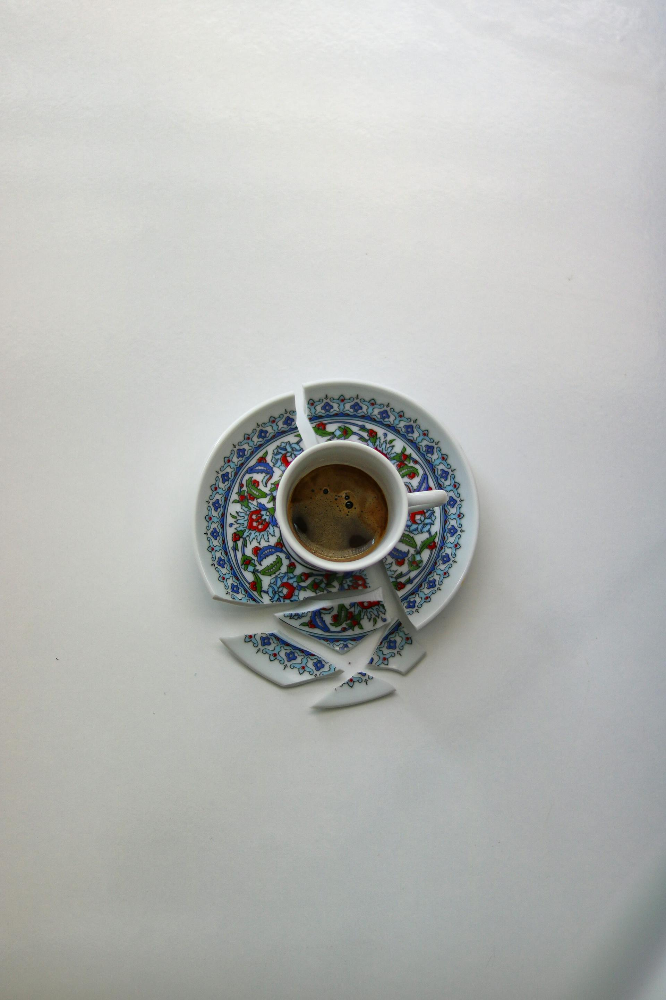

<h1 align="center"> ملحمة معالج : صراع مع الجِنِّ </h1>
---
<h1 align="right">بطل الدرجات المنخفضة</h1>

لماذا الأمور في المستشفى صعبة لهذا الحد؟ لماذا يصرخ الجميع في وجهي؟ دعني أعرفك بنفسي: أنا عمير، طبيب متدرب في أحد المستشفيات الجامعية، أو كما يطلقون علينا "طبيب امتياز". لأننا لمدة عامين نتعلم في كل التخصصات حتى نستطيع ممارسة أي تخصص نختاره.حالي كحال ٩٥٪ من طلاب الطب، نبحث عن شيئين: الدرجات المرتفعة والزوجة الصالحة. ولأنني فقدت الأولى، شرعت في البحث عن الثانية. أتمنى ألا أرجع بخفي حنين. لم أدخل بيت أحد بغرض الخطبة من قبل، لكنني أدعو وأجتهد قدر استطاعتي.

<h1 align="right"> حساسية من التشريح</h1>

كان تخصص الطب النفسي هو ما يناسبني كثيرًا. لن يكلمني أحد الساعة الثالثة فجراً للقيام باستئصال ورم مثلاً، ولن أضطر لدراسة المزيد من مادة التشريح التي لا تنتهي ولا تُحفظ. قد تعتقد أنني طالب فاشل دراسيًا يختار الخيارات الأسهل. لا أحد هنا يختار ما يحبه. تبدو جملة مرعبة، صحيح؟ ما فائدة اختياري للجراحة العامة وأنا لا أستطيع حمل مشرط أو التعرف على الشريان الأورطي وتفرعاته؟على كلٍ، ولله الحمد، كان الطبيب مصطفى هو المسئول عني وعن زملائي في قسم الطب النفسي، سواء في المرور على الحالات أو التعلم عن الأمراض النفسية. لقد كان رجلاً حكيماً يحمل الكثير من الخير في قلبه، فلم يبخل علينا بحرف. علمت أيضاً أن ابنته منار تدرس معنا، والغريب في الأمر أنه لم يفضلها علينا يوماً.

<h1 align="right"> نوعاً جديداً من القهوة </h1>

في إحدى ساعات العمل الطويلة وقبيل انتهائها، ناداني الدكتور مصطفى ثم سألني: "عمير، أنت متزوج؟" يا له من سؤال لبدء المحادثة يا دكتور! نظرت إلى يدي الخالية من أي خواتم وقلت: "لا يا دكتور". ثم رد قائلاً: "طيب، مش ناوي تيجي تشرب كوباية قهوة معايا وتتعرف على بنتي منار؟ عندي قهوة كولومبية جميلة أوي". يبدو هذا تقريباً عرضاً للزواج، ولا شك أنه العرض الأول والأكثر تهذيباً. أجبت بخجل: "يشرفني يا دكتور".

<h1 align="right"> ما تريده لا يريدك </h1>

وها أنا ذا أمام باب الدكتور مصطفى بعد نقاش طويل مع الوالدين. وعلى الرغم من جمال الأحداث، إلا أن الدكتور مصطفى طلب طلباً غريباً، إذ طلب مني أن آتي منفرداً لتجنب أي إحراج في حالة عدم التوفيق، لا قدر الله. حسناً، أتمنى ألا يقتلني الليلة فلدي مباراة هامة مع أصدقائي غداً.  وكعادة الزيارات من هذا النوع، استقبلني الدكتور مصطفى بحفاوة بعد صلاة العشاء مساء الخميس. ولكن لسبب ما، مع دخولي البيت شعرت بخوف وضيق في صدري، وعندما جلست على الأريكة أوهمت نفسي أنه أثر إجهاد العمل. ثم في مشهد كلاسيكي، دخلت ابنته منار مرتدية فستانًا أبيض وخمارًا أسود، وكأنها تنير من شدة الجمال. وبما أن الصمت في حرم الجمال جمال، أغلقت فمي عنوة خوفاً من أن أنهي هذه الأمسية بإحدى عثراتي. استأذن الدكتور مصطفى وجلس على الكرسي بعيدًا قليلاً في مكان استراتيجي يتيح له مراقبة الأوضاع، كعادة الرؤية الشرعية. جلست منار في استحياء ونظرت إلي مبتسمة، وكل ما يدور في رأسي: كيف لم تتزوج هذه حتى الآن؟ لكن الجواب جاء مبكراً، فبدأت كلامها: "أتدري يا عمير، أنت وقح للغاية. لديك ما يكفي من الجرأة لتأتي هنا وأنت سيء المظهر، كبير الأنف، خفيف الشعر، لديك من الدهون ما يكفي لسد مجاعات. كل شيء تلمسه ينطفئ، وجودك يشكل خطراً على الجميع". كنت مصعوقًا، لكن لساني أبى السكوت فسألتها: "وما أدراكِ بكل هذا؟" نظرت إلي ممتعضة واقتربت وقالت: "أنا أراقبك منذ فترة كبيرة، ليس لأني مولعة بك، ولكن وجودك يشعرني بالأمان، فكلما رأيتك علمت أن هناك من هو أفشل وأسوأ مني. أنت تكره مادة التشريح والصوت العالي والازدحام. أتريد أن أخبرك عن أصدقائك المقربين أم عن كتبك المفضلة؟" وهنا قررت أن أرحم أذني واستأذنت من الدكتور مصطفى وشكرته ورحلت. رحلت قبل أن تذكر عصير المانجو بأي سوء، فهذا الذي لن أقبله أبدًا.

<h1 align="right"> جمال كاذب و عواقب وخيمة </h1>

بينما أنا عائد إلى منزلي أستكشف شوارع القاهرة المزدحمة وأصواتها المرتفعة، ظللت أفكر: كيف تعرف هذا كله؟ لست أنا الشخص الذي يتحدث كثيرًا، ولماذا تحولت فجأة؟ لماذا كان مع كل كلمة تتفوه بها يزيد صوتها خشونة ويقل جمال وجهها؟ لماذا ظهر على وجهها التجاعيد فجأة؟ أيعقل أنها لم تتحمل جمالي؟ لم يزعجني كلامها، فقد سخر أصدقائي من أنفي بطرق أكثر شدة، منهم من شبهه بالمسدس والآخر بالبندقية، فلم أعد أهتم. حتماً هؤلاء الناس فقدوا القدرة على فهم أن هذا كله من خلق الله، فماذا تقولون؟ مر اليوم بسلام على حد مخيلتي، ثم جاء الصباح وبدأت مشاكل أخرى. الآن علي التعامل مع الدكتور مصطفى بعدما رفضتني ابنته. صار الدكتور مصطفى غريب الطبع، لو دخلت من باب المستشفى لوجدته إما ينادي على عمير أو يصرخ عليه، كأني مشكلة حياته الكبرى. أم للقهوة الكولومبية تأثير آخر؟ لا يهم، كما أخبرتك لا أهتم بهكذا تفاصيل.

<h1 align="right"> قهوة كولومبي بشارب مختلف</h1>

تمر الأيام ويأتي أحمد صديقي ليحدثني أن الدكتور مصطفى يريد شرب القهوة معه ليتعرف على ابنته، وأخبر أحمد عن جودة البن الكولومبي لديه. ومنذ متى يا أحمد وأنت تشرب القهوة أصلاً؟ في هذه اللحظة شعرت أن الدكتور مصطفى إما ملياردير اشترى بكل ما يملك قهوة كولومبية أو أنه هو نفسه يملك مزرعة قهوة في كولومبيا. على كل، سألني أحمد عن رأيي فهو يعلم أنني دخلت بيت الدكتور مصطفى من قبل. أخبرته أنهم أناس خيّرون، وأنه يجب أن يصلي صلاة الاستخارة أولاً، لكن أخبرني متأخراً فقد كان معاده اليوم -الخميس- بعد صلاة العشاء. تمنيت له التوفيق والسداد، وفي داخلي أتمنى ألا تحطم منار فؤاده. "وافقت، يا عم". كان هذا أول ما سمعته بعدما اتصل بي في إحدى الليالي في منتصف الليل. حتى أكون صريحاً لم أشعر بأي حزن إطلاقاً، لكن تغذى بداخلي شعور أنني لم أكن كافياً، وأن الجميع بشكل ما أفضل مني. حاولت تجاهل هذه المشاعر. أحمد يستحق كل الخير، ودعنا نأمل أن منار هي شكل من أشكال الخير.

<h1 align="right"> احتفالات من جهة وتضييق من جهة أخري</h1>

تمر الأيام والسنين ويتزوج أحمد، ويزداد تضييق الدكتور مصطفى عليّ على الرغم من أنني لم أعد طبيب امتياز بعد الآن. لكن بشكل ما كان الدكتور مصطفى يعلوني علماً ومكانة، وكان يستغلها أسوأ استغلال. أتعلم ماذا يعني أن تلاعب طبيب نفسي؟ ولكي لا أنسى، هو حاصل على الدكتوراه من جامعة أكسفورد ببريطانيا. الآن صارت المواجهة أكثر إنجليزية، أليس كذلك؟ وبما أن أحمد تزوج ابنته، وجد الدكتور مصطفى لأحمد مكاناً في مستشفى خاص بجانب عمله الحكومي. أترفع عن ذكر اسمها حتى لا يقاضوني وأنا لا أملك ما يكفي من المال لتوكيل محامٍ! تمر السنين ويتوفى الدكتور مصطفى، ويحضر جنازته الكثير، منهم منار وزوجها أحمد. لا أدري لماذا صار نحيفاً هكذا، أهذا مفعول القهوة؟ ولماذا تلتف حوله منار كالأفعى؟ ألا تشعر بأي حزن؟ قد مر على زواجهما ما يقارب ثلاث سنين ولم ينجبا حتى الآن. لا أتدخل فيما لا يعنيني، ولكن يبدو أن الأحوال المادية ليست في أفضل حالاتها. وبينما أنا أهرب من واقعي بتصفح الفيسبوك عسى أن أعثر على ما يسكنني، وجدت منشوراً لأحمد وزوجته يحتفلان بذكرى زواجهما الثالثة. أحمد الذي لم يكلمني إلا مرة واحدة منذ زواجه منذ ثلاث سنوات! وأحدهم يتحدث أن النساء لا تؤثر على قرارات الرجال؟ ماذا تفعلين يا منار؟ بعد مرور أربعة أشهر على وفاة الدكتور مصطفى، وتحتفلون!

<h1 align="right"> ظلال سوداء و مكالمات مفزعة في نصف الليل</h1>

هممت إلى النوم، ولكن رن هاتفي. من يريدني في هذا الوقت المتأخر؟ "عمير، في مشكلة كبيرة وأحمد هيروح فيها، أنا تحت بيتك انزل حالاً"، هكذا بدأ محمود كلامه. لم أتوقع مثل هذه المكالمة في هذا الوقت الخميس مجددًا. هل ستصبني منار أيضًا هذه المرة؟ سألته ماذا يجري وما سبب كل هذه الجلبة؟ قال كلامًا بدا لي غريبًا: "أنا عارف إن أنت الوحيد اللي هتصدقني. فاكر قصص ما وراء الطبيعة اللي كنا بنقرأها؟ شكلنا قدام واحدة منها". بدلت ملابسي وهرعت إلى أسفل منزلي، وما أن رآني حتى بدأ كلامه قائلًا: "كنت قاعد بكلم أحمد فيديو كول وإحنا بنلعب زي كل خميس عادي، وفجأة ظهر صوت صويت وظل أسود وراء أحمد عمال يهمس بكلمات غريبة وقفل المكالمة ومبيردش من وقتها".  يا ترى ما هذا؟ نوع من الدعابة السخيفة؟ سألت محمود أكثر سؤال يجده ليس له علاقة: "كان بيشرب قهوة هو اللي عاملها؟" رد علي بغضب: "وده وقته يا عمير، أيوة كان بيشرب، بس مراته اللي جابتهاله وإحنا بنلعب". بدأت الخيوط تتشابك في دماغي، لكن أحتاج أن أتأكد. لم لا نكلم منار؟ من المؤكد أنها تعلم ماذا يحدث. أخذت من محمود هاتفه حتى أكلمها، كانت في مجموعة مشتركة مع باقي أعضاء المستشفى، وإذا كنت تسأل لماذا لم أكلمها من هاتفي، لأنها قررت حظري منذ عدة سنوات.

<h1 align="right"> مكالمة مع الجن برصيد منتهي</h1>

هذا كان أول ما سمعته: "رصيدك خلص بس الكلام لسه مخلصش". حقاً يا محمود، ألا تستطيع شحن رصيدك حتى! لكن المكالمة أكملت على كل حال. وردت منار ولم أنطق، بل نطقت هي أولًا بما أفزعني: "لو فكرت تقرب من البيت يا عمير هموتك أنت ومحمود وأي حد يقرب لكم". يبدو أنها تتحداني. سألتها: "ماذا تريدين؟" ردت بكل قوة: "أنا مش عايزة حاجة، أحمد صاحبكم قبل الفجر هيبقى عبارة عن عضم من غير لحم. أنت عمرك مفكرت يا عمير ازاي أبويا طلب إنك تيجي البيت وبعدين أنا رفضتك؟ مسألتش نفسك أنا عرفت كل ده إزاي؟ مستغربتش ازاي صوتي اتغير؟ أنا شكلًا منار، لكن أنا جن عاشق لمنار، ولو أي حد حاول يقرب لها هشيله من على الأرض. منار دي بتاعتي، بتاعتي أنا وبس!" ثم أغلق الخط، أو أغلقت الخط ما عدت أستطيع التفريق. يبدو أننا أمام مأزق كبير يتطلب سرعة وجود الحل.

<h1 align="right"> خير استعداد لبئس معركة</h1>

طلبت من محمود أن يرحل، أن يعود إلى منزله وأن يدعو الله حتى تتوقف أنفاسه. إنها معركتي وعلي إنهاؤها، أنا من فعلت هذا بمحمود. ركبت سيارتي وهرعت إلى منزل أحمد بالدقي، وقرأت كل ما أذكره من أذكار وقمت بتشغيل المذياع على سورة البقرة بصوت القارئ مشاري راشد العفاسي وسألت الله أن ينجيني.

<h1 align="right"> في مواجهة الجن وجهاً لوجه</h1>

وصلت أمام بيت أحمد، مبنى شاهق الارتفاع هادئ المحيط، وكان الجميع ذهب في سبات عميق، ولم لا؟ الساعة الآن الثانية بعد منتصف الليل. علي الإسراع! صعدت إلى الدور الثاني حيث يسكن أحمد، وما أن اقتربت من الباب حتى فُتح فجأة، وإذ بمنار تظهر من خلفه، كانت شخصًا آخر، ملامحها يبدو عليها الغضب الشديد. وما أن بدأت كلامها حتى أدركت أنه ليس صوتها أيضًا، قالت بصوت عالٍ: "قررت تلعب يعني؟ بقوانيني"، ثم ركضت ركضاً سريعاً متجهة إلى غرفة بالداخل، ولأن بي قدراً من البلاهة اكتسبته بيدي ركضت خلفها. دخلت الغرفة التي على ما تبدو غرفة نومهما، لكن كان هناك رائحة سيئة وقوية، نظرت إلى جانب السرير، يا الله، هذا جسد مسلوخ نصفه، ولكن وجهه سليم، إنه أحمد! ثم أُغلق الباب، تمنيت لو أن هذا هواء يونيو أو موجة تسونامي، وبدأت منار المزعومة تقترب مني، في هذه الأوقات تذكرت كلام أبي: "الجن ما تقدرش على المؤمن"، لكن المشكلة أنني أعلم أني مقصر، وأعلم أن موقفي هذا ليس له كاشف إلا الله. بدأت في قراءة الأذكار وتلاوة القرآن وآيات عن الجن، ومع كل آية تصرخ منار وتتلوي وأنا أزداد رعباً من جهة وأزداد أملاً أن الله سينجيني. مع آخر آية في سورة الجن وقعت منار مغشياً عليها، وكان أحمد قد مات بالفعل، أنا الآن محاط بالدماء والجن، لا أعلم إلى متى سيصمد عقلي. المشكلة هنا أنه لا يوجد أي دليل على ما حدث وهذا يعني أنني إما سأقضي عمري في السجن وإما سأعدم شنقاً.

<h1 align="right"> كيف أنقذ ذكاء محمود الحاد عمير من السجن؟</h1>

كانت الشرطة قد وصلت بالفعل، لكن كيف عرفوا؟ أرسل لي محمود فيديو بينما هم يتجهون نحوي، هل هذا الوقت المناسب يا محمود؟ جاء الضابط بينما أنا أحاول تحميل هذا الفيديو وبدأ في تصفيد يدي مما أدى إلى وقوع هاتفي على الأرض. بدأ الفيديو فجأة، فحمل الضابط الهاتف وسألني عن محتوى الفيديو. أجبته أنني لا أعلم شيئاً، لكن هذا الفيديو كان الأغلى، محمود كان خائفاً من كل هذا ولكن لم يقدر على تركي، لذا صعد إلى الشقة المقابلة لشقة أحمد على البناية المقابلة بعدما كلم صديقه علي الذي يسكن في هذه الشقة. المهم أن الفيديو كان يعرض كل ما يحدث بداية من دخولي الغرفة مع وجود الجثة قبل دخولي إلى سقوط منار على الأرض. لم يكن هناك دليل قاطع ضدي، فأخلوا سبيلي بعد الكثير من الأسئلة وكيف لا، فقد كنت محاطاً بالجثث، وبعد رفع البصمات كانت البصمات الموجودة على السكين والمشرط المستخدمين لسلخ جلد أحمد تابعة لمنار، أو ما نسميه منار. الجدير بالذكر أنني تبادلت الحديث مع منار في سيارة الشرطة حتى وصلنا لقسم الدقي، وكانت لا تتذكر معظم الأحداث بل لا تشعر بها، آخر ما تتذكره القهوة التي كانت تقدمها لي وقت محاولة خطبتها. حاولت أن أعرف تفاصيل أكثر منها، لكننا كنا قد وصلنا إلى قسم الشرطة وبدأ التحقيق.

<h1 align="right"> أولي زيارات قسم الشرطة و سر الانتصار</h1>

بعد خروجي من القسم، استقبلني محمود، ضممته بشدة ولا أتوقع أنني ضممت أحدًا هكذا من قبل. ذكاؤه بعد توفيق الله كان سبباً في ألا أعدم شنقاً. لم يدري أحد بما حدث إلا محمود وأنا ومن يعملون بقسم الشرطة. لم يعلم جيران أحمد ما حصل لأن الجثة حملت سريعاً، ولم يعرفوا اسمي ولا صلتي أصلاً وهذا أراحني كثيراً. لكنني تعلمت وقتها ألا أترك حفظ القرآن ولا أذكاري، لا أريد أن يقربني أي جن بإذن الله.

<h1 align="right"> و أخيرا تزوج عمير و لكن أي حلم هذا؟</h1>

ولأن كل المشاكل حلها الزواج كما يرى مجتمعنا، بعد هذه الحادثة بأسبوعين كانت قد حددت أمي لي موعداً مع والدة ووالد فتاة حتى أتقدم لخطبتها إذا فلح الأمر. جرت الأمور سريعاً، فقد زرت الفتاة ووالديها في بيتهم الذي يبدو عليه علامات البساطة كبيتنا، ولكنه كان مريحاً جداً نفسياً، وجرت الأمور على ما يرام ومنّ الله علي بمنة – زوجتي – قد تراني مجنوناً لكن منة أخبرتني فيما بعد أنها رأتني أصارع ثعباناً قبل أن أزور بيتهم، لكنها لم تكن تعرفني آنذاك.

<h1 align="right"> قهوة كولومبي بخلطة سرية</h1>

ما توصلت إليه تحليلاتي البسيطة المعطوبة، أن منار كانت تحوي جناً عاشقاً لا يريد أن يقترب منها أي أحد غيره، ووجود هذا الجن أثر بشكل ما على الدكتور مصطفى. فلا أدري أي حوار دار بينهم بعد رفضي خطبتها، ولكن منار ذكرت وجود شخص آخر، إحدى قريباتها أعطتها شيئاً لتضعه في القهوة ولا شك أن الدكتور مصطفى تأثر كما تأثر أحمد. لكن يا ترى من هي ؟ وما قصتها ؟ وما دافعها؟ فلندع هذه القصة لمرة أخرى.

